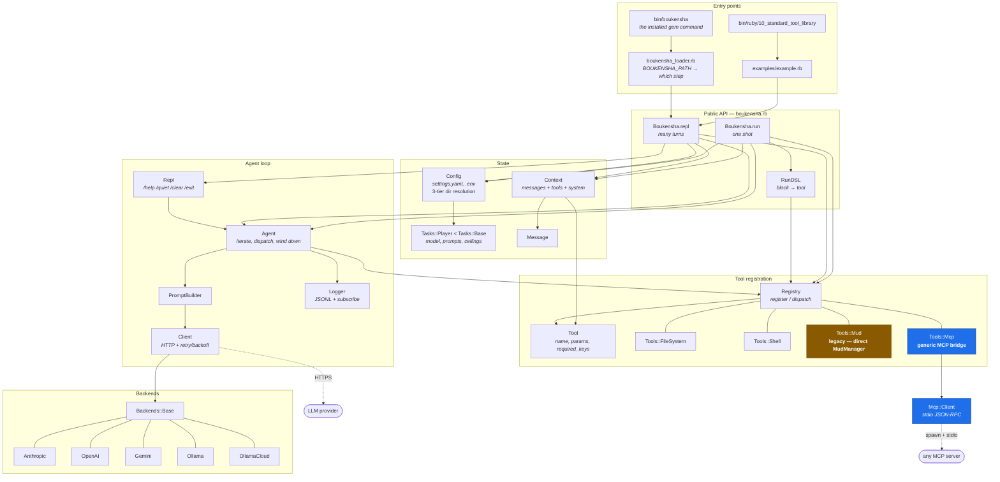
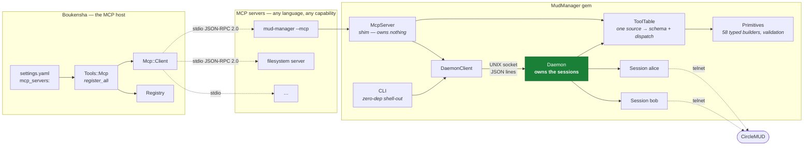
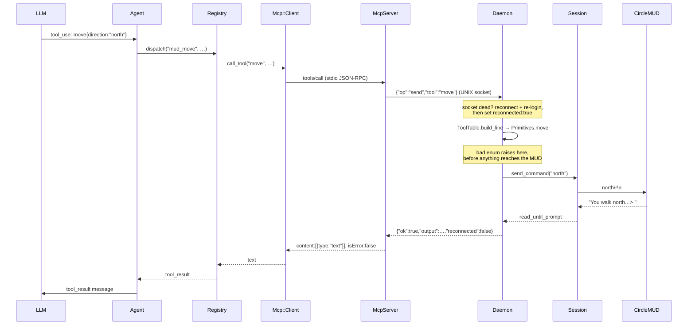
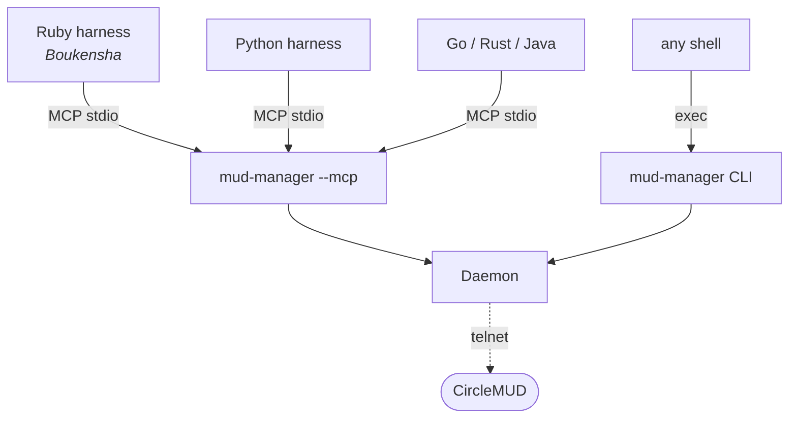
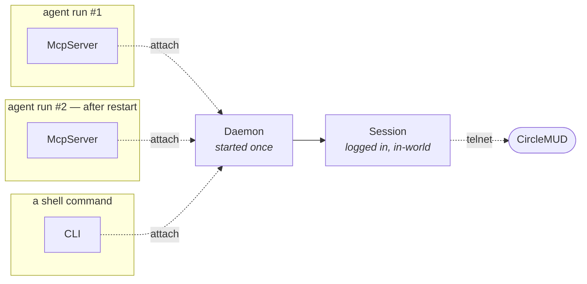
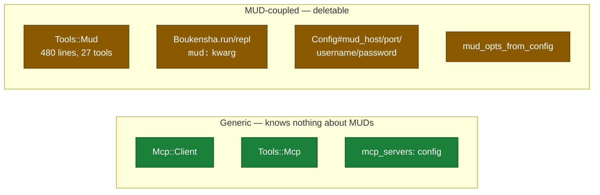

# Architecture — Ruby (step 10 + MudManager over MCP)

Everything in the Ruby tree as of step 10 `standard_tool_library`, including the
MCP layer. Companion docs:
[`plans/mud_manager/generic_interfacing.md`](plans/mud_manager/generic_interfacing.md)
(why) and [`plans/mud_manager/implementation.md`](plans/mud_manager/implementation.md)
(what).

---

## 1. Whole system

**Blue is new** (the MCP layer). **Amber is legacy** — `Tools::Mud` wires
MudManager in directly and is what the MCP path replaces.

---

## 2. The MCP layer

The host is server-agnostic: `Mcp::Client` and `Tools::Mcp` contain no MUD code.
A server is a `command` + `args` + `env` in `settings.yaml`.

**Why the shim owns nothing.** MCP's stdio transport makes the server a child of
the agent process. A server holding the telnet session would lose it on every
agent restart — a fresh 7-step login and a visible reconnect in-game. The daemon
(green) outlives every client; the MCP server and CLI are both translation
layers onto it.

---

## 3. One tool call, end to end

Validation happens **once**, in `Primitives`, on the server side — so every
language inherits it. A caller sending `direction: "sideways"` gets
`invalid direction: "sideways" (expected one of north, east, …)` rather than a
mangled line reaching the game.

---

## 4. Cross-language reach

| Consumer | What it writes for MUD access |
|---|---|
| Ruby | nothing — a config entry |
| Python | nothing — a config entry once its harness speaks MCP |
| Go / Rust / Java | ~60 lines of MCP client, which the harness needs anyway for filesystem and shell tools |
| any shell | `mud-manager tool look` — zero dependencies |

---

## 5. Session lifetime

The reason the daemon exists, in one picture:

Restart the agent as often as you like — the character stays in the world.

---

## 6. Where the coupling still is

The MCP path is generic. The MUD-specific code in Boukensha is the **old** path,
and it predates the MCP work:

Deleting the amber boxes makes MUD support purely an `mcp_servers:` entry, which
is the direction `ITERATIONS.md` §10 describes. It has **not** been done — the
MCP path was added alongside so nothing working today breaks.

Session statefulness is *not* the cause of that coupling: session state lives
entirely server-side of the MCP boundary. What sessions do cost is semantic —
connect-before-use, and staleness after a reconnect — and that lands in the
model's reasoning, not in the harness.
