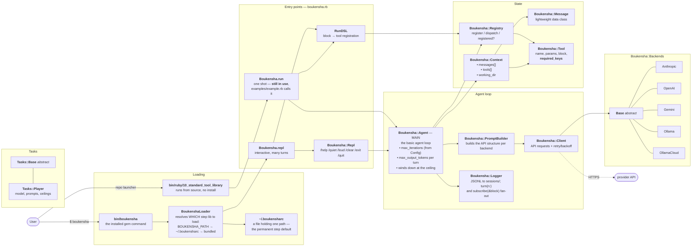
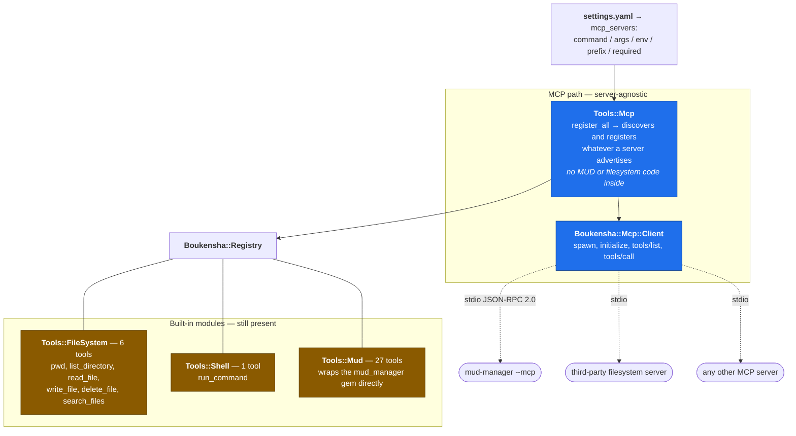
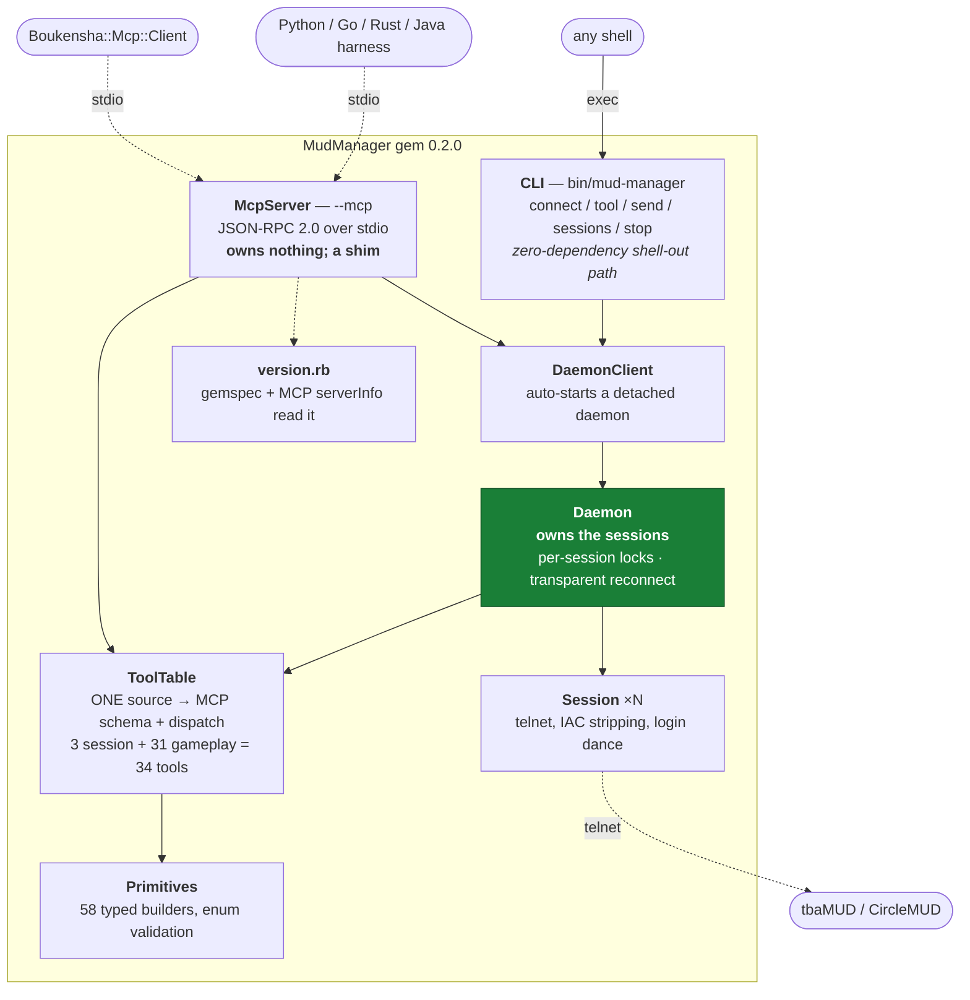
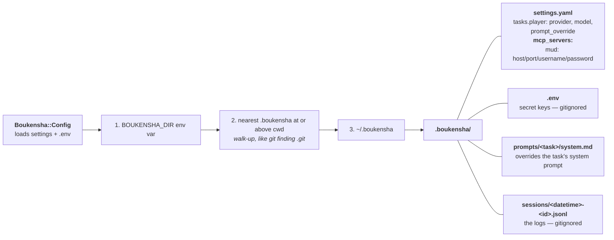
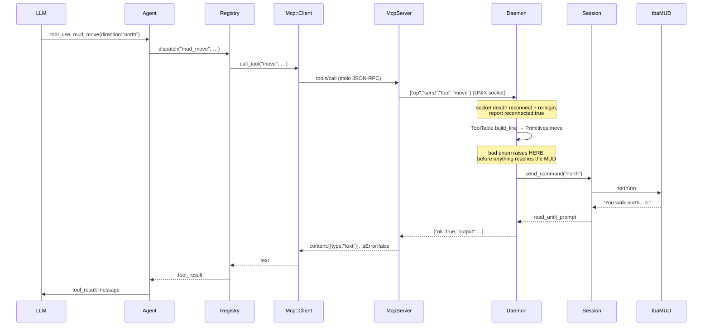
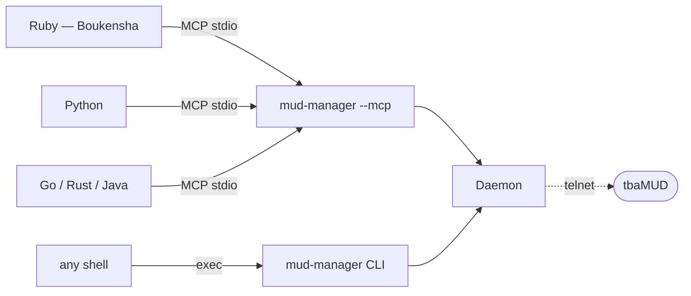

# Architecture — Ruby, actual state

Redraw of the Lucidchart *Claude Code Camp Agent Architecture — Baseline* against
what is actually in the tree at step 10 `standard_tool_library`.

**This is the as-built diagram, not the target.** Where it differs from the
Lucidchart version, §7 says which is ahead and why. Companion docs:
[`plans/mud_manager/generic_interfacing.md`](plans/mud_manager/generic_interfacing.md)
(why) and [`plans/mud_manager/implementation.md`](plans/mud_manager/implementation.md)
(what).

---

## 1. Whole system, as built

Deliberately unlike the Lucidchart version: **`Boukensha.run` is not "no longer
used"** — step 10's `examples/example.rb` calls it, and the repo launcher runs
that. There is also **no `Boukensha.tui`**; the TUI is step 11.

---

## 2. Tools — what is registered, and by whom

**Amber still exists.** The Lucidchart diagram shows no built-in tool modules —
that is the target. Both paths currently ship, so enabling the MUD server needs
`prefix: mud` or `mud: false`, or the names collide (`Tools::Mcp` raises rather
than silently shadowing).

---

## 3. MudManager — including the daemon

The largest structural difference from the Lucidchart version, which shows the
MCP server holding the session directly.

**Why the daemon exists.** MCP's stdio transport makes the server a child of the
agent process. If the session lived in the server, every agent restart would mean
a fresh 7-step login and a visible disconnect/reconnect in-game — worst exactly
when a student iterates fastest. The daemon (green) outlives every client.

Sessions run in parallel — five concurrent logins complete together, and one
player logging in never stalls another. Commands *within* one session are
serialised, because a telnet socket has no request ids and interleaved sends
would steal each other's output.

---

## 4. Config

Three tiers, not two. The middle one was added so `boukensha` picks up a
project's own `.boukensha` from any depth inside it.

---

## 5. One tool call, end to end

Validation happens once, server-side, so every language inherits it.

---

## 6. Cross-language reach

---